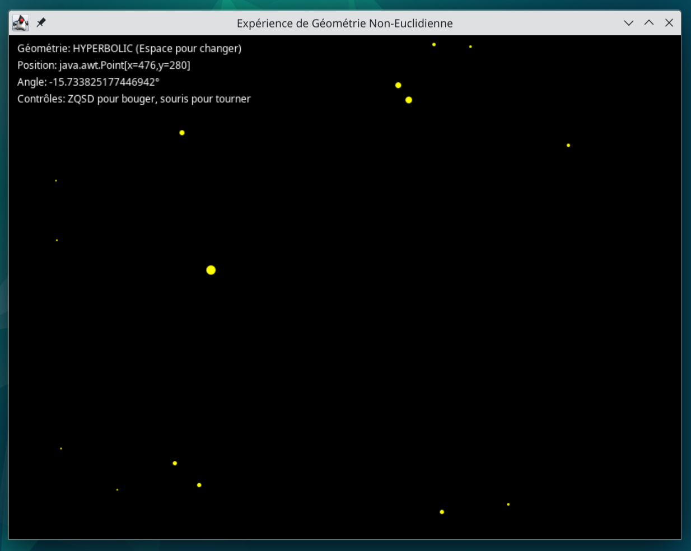

# NonEuclideanGame - Expérience Interactive de Géométrie Non Euclidienne

## Description
Application Java illustrant la différence entre espaces euclidiens et hyperboliques à travers une expérience visuelle immersive. Observez comment la courbure de l'espace déforme votre perception.

## Installation
1. Télécharger le fichier .jar
2. Exécuter avec Java :
  java -jar NonEuclideanGame.jar

## Commandes
- Z : Avancer
- S : Reculer  
- Q/D : Tourner gauche/droite
- Espace : Changer de géométrie
- Clic souris : Orienter la vue

## Mode Hyperbolique
• Les lignes droites apparaissent courbées  
• Distortion progressive des objets éloignés  
• Effet "fish-eye" prononcé  
• Distances lointaines exagérées

## Prérequis
Java 8+ requis. Installation sur Debian : sudo apt install openjdk-17-jre

## Licence
Projet sous licence MIT - libre d'utilisation et modification.
